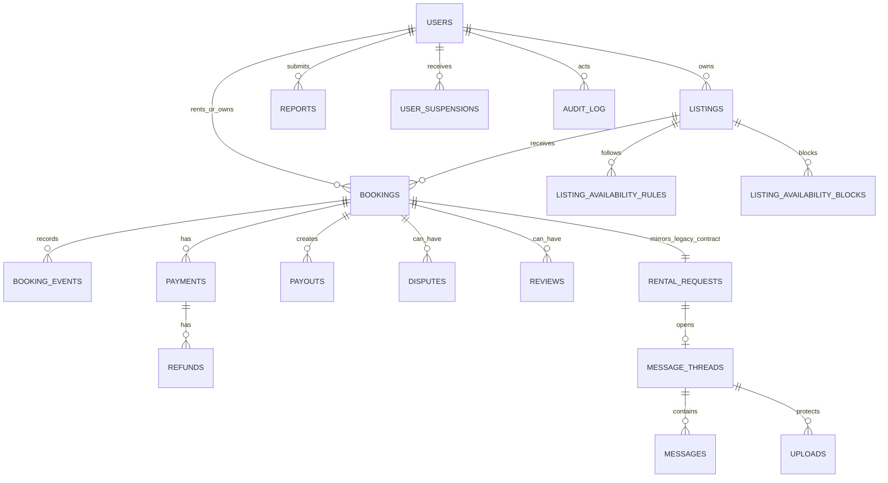

# B3 — Buchungs-, Daten- und Berechtigungsfundament

Stand: 8. August 2026  
Branch: `codex/master-workflow-20260808`

## Ergebnisziel

B3 macht Buchungen, Geldbeträge, Zeiträume und private Daten technisch
eindeutig. Kritische Werte liegen nicht mehr nur in flexiblem JSON. Eine
verbindliche Datenbankregel verhindert, dass derselbe Gegenstand für
überlappende Zeiträume zweimal angenommen wird.

## Datenmodell

### Normalisierte Kernwerte

| Bereich | Verbindliche Felder |
|---|---|
| Nutzer | Rolle und Kontostatus |
| Inserat | Währung, Tagespreis in Cent, Kaution in Cent |
| Buchung | Besitzer, Mieter, Status, Start, Ende, Währung, Beträge, Version |
| Geldfluss | Betrag in kleinster Währungseinheit, Währung, Status, Idempotenzschlüssel |
| Verfügbarkeit | Zeitzone, Wochentag, lokale Zeiten sowie konkrete Sperrzeiträume |
| Dateien | Zweck, Sichtbarkeit und optionale Zuordnung zu Inserat oder Chat |
| Nachweis | unveränderliche Buchungsereignisse und Audit-Einträge |

JSONB bleibt nur für flexible Metadaten, Provider-Antworten und die zeitweise
Rückwärtskompatibilität mit der aktuellen Flutter-App erhalten.

## Harte Datenbankregeln

- Start muss immer vor Ende liegen.
- Geldbeträge sind nicht negativ und werden als ganze Cent gespeichert.
- Währungen verwenden drei Großbuchstaben.
- Besitzer und Mieter einer Buchung müssen verschieden sein.
- Fremdschlüssel verhindern verwaiste Buchungen, Zahlungen und Nachrichten.
- Pro Provider-Operation erzwingen eindeutige Idempotenzschlüssel genau eine
  Zahlung, Erstattung oder Auszahlung.
- Für `accepted` und `running` verbietet eine PostgreSQL-Exclusion-Constraint
  jede zeitliche Überschneidung auf demselben Inserat.
- Buchungsereignisse und Audit-Einträge sind append-only; nachträgliches
  Ändern oder Löschen wird von der Datenbank abgewiesen.

## Berechtigungsmatrix

Die sichere Standardentscheidung für Support lautet: lesen und kommentieren
bei Reports/Disputes, aber keine Buchungs-, Geld-, Rollen- oder Audit-Änderung.

| Ressource/Aktion | Öffentlich | Nutzer | Beteiligter Besitzer/Mieter | Support | Admin |
|---|---:|---:|---:|---:|---:|
| Aktives Inserat lesen | ja | ja | ja | ja | ja |
| Eigenes Inserat ändern | nein | nur eigenes | nur eigenes | nein | ja |
| Buchung lesen/ändern | nein | nein | ja, nach Statusregel | nein | ja |
| Chat lesen/schreiben | nein | nein | ja | nein | ja |
| Öffentliches Inserat-/Profilbild lesen | ja | ja | ja | ja | ja |
| Privaten Upload lesen | nein | nein | Besitzer oder Chat-Teilnehmer | nein | ja |
| Report/Dispute bearbeiten | nein | eigener Fall | eigener Fall | lesen/kommentieren | ja |
| Zahlung/Auszahlung lesen | nein | nein | erst über künftigen eng begrenzten Endpoint | nein | ja |
| Audit-Log lesen | nein | nein | nein | nein | ja |

Alle heute geschützten HTTP-Endpunkte prüfen zusätzlich zum gültigen Token den
aktuellen Datenbankstatus des Kontos. Gesperrte, geschlossene oder deaktivierte
Konten werden abgewiesen. Das gilt auch beim Aufbau einer Echtzeitverbindung.

## Migration und Rückwärtsstrategie

1. `schema.sql` stellt weiterhin das alte, von der App erwartete Grundschema
   bereit.
2. Nummerierte `*.up.sql`-Migrationen laufen sortiert und einzeln in einer
   Transaktion.
3. Jede ausgeführte Migration wird mit SHA-256-Prüfsumme gespeichert. Eine
   später veränderte bereits ausgeführte Datei blockiert den Start.
4. Die B3-Migration ist additiv. Bestehende JSON-Daten werden geprüft und in
   normalisierte Tabellen übernommen. Ungültige Zeiträume oder bereits
   überlappende aktive Buchungen stoppen die Migration sichtbar.
5. Während der Übergangsphase schreibt die API Buchungen sowohl in den alten
   App-Vertrag (`rental_requests.payload`) als auch in `bookings`.
6. Bei einem App-Rollback wird nur auf das vorherige Image zurückgeschaltet.
   Das additive B3-Schema bleibt bestehen und wird vom alten Code ignoriert.
   Dadurch ist kein riskantes Schema-Downgrade nötig.
7. Korrekturen erfolgen immer als neue vorwärtsgerichtete Migration; eine
   bereits ausgeführte Migration wird nie nachträglich geändert.

## Aufbewahrung und Löschung

Bis die rechtliche Produktentscheidung bestätigt ist, werden Zahlungs-,
Buchungs-, Streitfall- und Audit-Daten nicht automatisch gelöscht. Private
Uploads besitzen bereits einen eindeutigen Zweck und eine Ressourcenzuordnung,
damit B10 daraus sichere Aufbewahrungs- und Löschjobs ableiten kann. Vor dem
öffentlichen Start werden je Datenklasse eine bestätigte Frist, ein Legal-Hold-
Verhalten und ein nachweisbarer Löschlauf ergänzt. Dies ist bewusst als Gate
markiert und keine stillschweigende Rechtsannahme.

## Automatische Nachweise

- Einheiten-Tests für Zeitraum, Währung, Cent-Beträge und Statusübergänge.
- Berechtigungstests für Beteiligte, Außenstehende, Support, Admin sowie
  gesperrte Konten.
- Echter PostgreSQL-Test in CI für Migration und wiederholten Start.
- Konkurrenztest: Zwei gleichzeitig angenommene, überlappende Buchungen;
  genau eine darf erfolgreich sein, die andere erhält PostgreSQL `23P01` und
  die API übersetzt dies in `booking_period_unavailable` (HTTP 409).
- API-Grenztest: Außenstehende erhalten keine fremden Buchungen oder Chats und
  keinen privaten Upload; ein berechtigter Teilnehmer kann denselben Upload
  lesen.

## Noch zu erfüllende B3-Gates

- CI-Lauf mit echtem PostgreSQL muss vollständig grün sein.
- Staging-Migration und Datenqualitätsabfragen müssen grün sein.
- Staging-Konkurrenztest muss genau eine erfolgreiche Annahme nachweisen.
- Backup vor Migration, Vorwärtsmigration, Image-Rollback und isolierter
  Restore müssen gemeinsam nachgewiesen werden.
- Aufbewahrungsfristen brauchen vor dem öffentlichen Start eine bestätigte
  Produkt-/Rechtsentscheidung.
