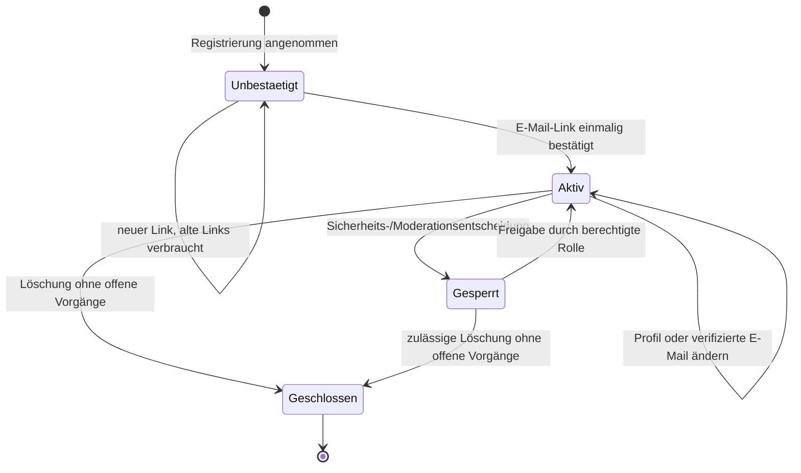
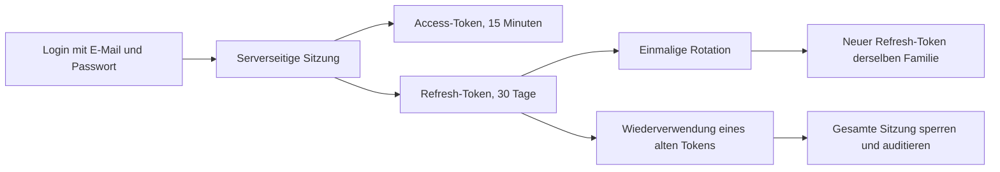

# B4 — Konten und Authentifizierung

Stand: 9. August 2026

Branch: `codex/master-workflow-20260808`

Status: technisch bestanden; CI, Staging, Rückrollung und isolierter Restore sind belegt.

Abgenommener Code-Stand: `2114b45d2509be2da1c391419d04c270e271d78c`

CI-Nachweis: GitHub Actions `regression` Lauf `31284125036`

## Ergebnisziel

B4 macht den vollständigen Lebenszyklus eines ShareItToo-Kontos serverseitig
verbindlich: Registrierung, E-Mail-Bestätigung, Anmeldung, erneuerbare
Sitzungen, Abmeldung, Passwort- und E-Mail-Wechsel sowie Kontolöschung. Die
Flutter-App ist dabei nur die Bedienoberfläche; Kontostatus, Sitzungen,
Bestätigungen und Sicherheitsentscheidungen liegen im Backend.

## Launch-Entscheidungen

- Zum ersten Launch wird ausschließlich E-Mail und Passwort angeboten.
- Google- und Apple-Anmeldung werden in produktivem Backend-Modus nicht
  angezeigt, solange Provider-Konfiguration, sichere Kontoverknüpfung und
  Store-Vorgaben nicht vollständig abgenommen sind.
- Die Registrierung erfordert eine ausdrückliche Bestätigung von AGB,
  Datenschutz und einem Mindestalter von 18 Jahren.
- Telefonnummern sind optional. Sie werden normalisiert gespeichert, gelten
  aber ohne angebundenen SMS-Dienst ausdrücklich als nicht verifiziert.
- Neue Passwörter benötigen 10 bis 200 Zeichen, mindestens einen Buchstaben
  und mindestens eine Zahl. Bestehende ältere Passwörter bleiben bis zur
  nächsten Änderung anmeldbar.

## Kontolebenszyklus

## Registrierung und Verifikation

- Die API antwortet bei neuer und bereits vorhandener Adresse gleichförmig mit
  HTTP 202. Dadurch lässt sich der Kontobestand nicht über die Registrierung
  auslesen.
- Passwörter werden ausschließlich als gesalzene Scrypt-Hashes gespeichert.
- Bestätigungslinks enthalten zufällige Einmal-Tokens. In der Datenbank liegt
  nur SHA-256 des Tokens; ältere offene Tokens desselben Zwecks werden beim
  Neuanfordern verbraucht.
- Ein unbestätigtes Konto erhält keine Sitzung. Erst nach erfolgreicher
  E-Mail-Bestätigung ist eine Anmeldung möglich.
- Bestätigungslinks sind zeitlich begrenzt, nur einmal verwendbar und werden
  in sicheren HTML-Seiten ohne Referrer-Weitergabe verarbeitet.

## Sitzungen und Token-Rotation

- Jeder Access-Token enthält eine Sitzungs-ID. Geschützte HTTP-Endpunkte,
  WebSockets und private Uploads prüfen zusätzlich, ob diese Sitzung in der
  Datenbank noch aktiv ist.
- Refresh-Tokens werden bei jeder Nutzung ersetzt. Die Wiederverwendung eines
  bereits rotierten Tokens sperrt die gesamte betroffene Sitzung.
- Nutzer sehen ihre aktiven Geräte/Sitzungen und können eine einzelne Sitzung
  oder alle Geräte abmelden.
- Passwort-Reset, Passwortwechsel und bestätigter E-Mail-Wechsel beenden alle
  bestehenden Sitzungen und entfernen Push-Geräte.

## Schutz gegen Angriffe

| Risiko | Serverregel |
|---|---|
| Konto-Aufzählung | gleichförmige Registrierung, Reset-, Verifikations- und Löschanfragen |
| Passwort-Raten | IP-Limits plus kontobezogene 15-Minuten-Sperre nach 10 Fehlversuchen |
| Token-Diebstahl | nur Token-Hash gespeichert; kurze Laufzeit; Einmalverbrauch |
| Refresh-Replay | Rotation und Sperre der vollständigen Token-Familie/Sitzung |
| Gestohlene Sitzung | aktive Sitzung bei jedem geschützten Zugriff erneut prüfen |
| Rechteausweitung im Profil | Rollen-, Status- und Verifikationsfelder nicht durch Profil-Payload änderbar |
| E-Mail-Übernahme | aktuelles Passwort, Verifikation der neuen Adresse, Hinweis an alte Adresse, danach globale Abmeldung |
| Unsichere Telefonnummer | nur E.164-Format; bei Änderung wird Verifikationsstatus gelöscht |

## Sicherer E-Mail-Wechsel

1. Der angemeldete Nutzer gibt neue Adresse und aktuelles Passwort ein.
2. Das Backend prüft Passwort, Format und Eindeutigkeit.
3. Die neue Adresse erhält einen einmaligen 24-Stunden-Link; die bisherige
   Adresse erhält eine Sicherheitswarnung ohne Token.
4. Erst der Link ändert die Login-Adresse und markiert sie als bestätigt.
5. Alle bisherigen Sitzungen und Push-Geräte werden beendet. Die nächste
   Anmeldung erfolgt mit der neuen Adresse.
6. Audit-Metadaten speichern nur einen Hash der neuen Adresse, niemals die
   Klartextadresse.

## Passwort und Wiederherstellung

- Reset-Anfragen geben unabhängig vom Kontobestand dieselbe Antwort.
- Der Reset-Link ist 30 Minuten gültig und nur einmal nutzbar.
- Reset und Passwortwechsel erzwingen dieselbe Passwortregel.
- Nach erfolgreicher Änderung werden Anmeldefehler zurückgesetzt und alle
  Sitzungen ungültig.
- Falsche aktuelle Passwörter ergeben eine generische Fehlermeldung.

## Profil, Alter und Geräte

- Mindestalter und rechtliche Zustimmungen werden als serverseitige
  Zeitstempel gespeichert.
- Ein angegebenes Geburtsdatum muss zum Mindestalter passen und darf kein
  unrealistisches Alter über 120 Jahren ergeben.
- Telefonnummern werden in E.164 normalisiert; eine Änderung entfernt eine
  möglicherweise frühere Verifikation.
- Push-Token gehören zu Nutzer und Sitzung. Einzelne Geräte, globale Abmeldung
  und Kontolöschung entfernen diese Zuordnung.

## Kontolöschung

Die Löschung ist sowohl in der App als auch über die öffentliche Seite
`https://shareittoo.com/api/v1/account-deletion` verfügbar. Die öffentliche
Variante sendet einen 30 Minuten gültigen Einmal-Link an die Konto-Adresse.

Vor der Löschung blockiert das Backend bei:

- aktiven oder bevorstehenden Buchungen;
- offenen Auszahlungen;
- laufender Zahlungsabwicklung;
- offenen Streitfällen.

Nach erfolgreicher Prüfung werden:

- E-Mail, Passwort, Profil, Telefon, Geräte, Identitäten und Tokens gelöscht
  oder anonymisiert;
- alle Sitzungen physisch entfernt und damit sofort ungültig;
- eigene Upload-Datensätze und die zugehörigen Dateien gelöscht;
- eigene Inserate beendet und auf einen nicht personenbezogenen Restsatz
  reduziert;
- eigene Nachrichtentexte entfernt und selbst verfasste Review-Texte
  gelöscht;
- Adress-, Kontakt- und Namensfelder aus beteiligten Buchungs-Payloads
  entfernt;
- weiterhin notwendige Buchungs-, Geldfluss- und Audit-Datensätze nur unter
  der pseudonymen Nutzer-ID erhalten.

Konkrete gesetzliche Fristen und Legal-Hold-Regeln bleiben ein bestätigtes
B10-Launch-Gate. B4 speichert keine stillschweigend erfundenen Fristen.

## Datenmodell und Migration

Migration `002_b4_auth_lifecycle.up.sql` ergänzt:

- rechtliche Zustimmungen, Telefonstatus, Anmeldesperre und Löschzeitpunkt am
  Nutzer;
- serverseitige Sitzungen und Refresh-Token-Familien;
- einmalige Aktions-Tokens für E-Mail-Wechsel und Kontolöschung;
- vorbereitete Google-/Apple-Identitäten ohne aktivierten Login;
- Push-Geräte mit Sitzungszuordnung.

Die Migration ist additiv. Bestehende Refresh-Tokens erhalten jeweils eine
eigene Legacy-Sitzung. Ein Datenbank-Trigger ergänzt auch bei einem temporären
Rollback neu angelegte Refresh-Tokens der älteren App automatisch um Sitzung
und Token-Familie. Das vorherige Image kann deshalb weiter anmelden und
erneuern, ohne das Schema zurückzudrehen. Änderungen an einer bereits
ausgeführten Migration sind verboten; Korrekturen erfolgen vorwärtsgerichtet
in einer neuen Datei.

Die reale Staging-Probe deckte dabei eine fehlerhaft maskierte PostgreSQL-
Regel für das führende `+` einer E.164-Telefonnummer auf. Die bereits
ausgeführte Migration 002 wurde nicht verändert. Stattdessen ersetzt die
vorwärtsgerichtete Migration `003_b4_phone_constraint_fix.up.sql` nur diese
Constraint durch die eindeutige Zeichenklasse `[+]`. Ein PostgreSQL-
Integrationstest beweist nun sowohl eine gültige internationale Nummer als
auch die Ablehnung eines nationalen Formats ohne `+`.

## Automatische Nachweise

- Einheiten-Tests für Passwortregel, Access-Token mit Sitzungs-ID, Einmal-Tokens
  und sämtliche Sicherheitsmails.
- Flutter-Analyse der geänderten Auth-, Kontakt-, Sicherheits- und
  Löschoberflächen ohne Fehler, Warnungen oder Hinweise.
- App-Regressionssuite mit 150 Tests sowie Web- und Android-Debug-Build.
- PostgreSQL-Integration für Migration und Wiederholung, Login,
  Refresh-Rotation, Replay-Sperre, Geräte-/Sitzungsliste, Passwortwechsel,
  E-Mail-Wechsel, kontobezogene Brute-Force-Sperre, Löschung, Anonymisierung,
  Datei-Löschung, Enumeration und Rate-Limit.

## Reale Staging-Abnahme

### Geprüfter Rollout

- Vor der ersten B4-Migration wurden Datenbank und Uploads gesichert:
  `pre-b4-20260808T230112Z.dump` und
  `pre-b4-20260808T230112Z-uploads.tar.gz` einschließlich erfolgreicher
  SHA-256-Prüfung.
- Das erste isolierte B4-Image zeigte beim Telefon-Probeaufruf den genannten
  Constraintfehler. Der Rollout wurde deshalb nicht freigegeben.
- Staging wurde auf das vorherige exakte Image
  `f059d3b5739c36dac3f829dac27d9c78e9f3cbb4` zurückgesetzt. API, Datenbank und
  Mail-Readiness blieben gesund.
- Auf dem erweiterten Schema erzeugte die ältere B3-App zwei Refresh-Tokens.
  Beide erhielten durch den Kompatibilitätstrigger automatisch eine passende
  Legacy-Sitzung und Familie; Login, Rotation und geschützter Zugriff waren
  erfolgreich. Damit ist die Rückrollfähigkeit praktisch bewiesen.
- Das Pre-B4-Backup wurde in einem getrennten PostgreSQL-Container
  wiederhergestellt. Nachweis:
  `/docker/sit-staging/backups/restore-checks/restore-check-20260808T233056Z-127345.json`.
- Nach grüner CI wurde das korrigierte exakte Image
  `shareittoo-api:2114b45d2509be2da1c391419d04c270e271d78c` ausgerollt.
  `/version`, `/health`, `/health/live` und `/health/ready` meldeten den
  erwarteten Commit, Umgebung `staging`, Datenbank `ok` und Mail `ok`.
- Die unter B3 erzeugte aktive Legacy-Refresh-Sitzung ließ sich nach dem
  Vorwärtsrollout durch B4 rotieren und ergab einen gültigen B4-Access-Token.

### Geprüfter Kontolebenszyklus

Die Staging-API-Proben haben ohne Produktionszugriff nachgewiesen:

- gleichförmige Registrierung mit HTTP 202 und verweigerte Anmeldung vor
  E-Mail-Bestätigung;
- zwei aktive Sitzungen, Refresh-Rotation und Sperre der betroffenen Sitzung
  nach Wiederverwendung des alten Refresh-Tokens;
- verifizierter E-Mail-Wechsel mit globaler Abmeldung;
- Passwortwechsel mit globaler Abmeldung und Ablehnung des alten Passworts;
- Kontosperre nach dem zehnten Fehlversuch;
- drei sichtbare Sitzungen und funktionierendes „Alle Geräte abmelden“;
- E.164-Telefon `+4915212345678` als bewusst nicht verifiziert;
- Speicherung eines echten Bild-Uploads;
- Lösch-Preflight ohne Blocker, Kontolöschung, Entfernung der Upload-Datei
  und jeweils null verbleibende Sitzungen, Refresh-Tokens, Aktions-Tokens,
  Push-Geräte, Identitäten und Upload-Datensätze;
- anonymisierten Nutzer-Restsatz mit geschlossenem Konto, gelöschtem
  Passwort, anonymisierter Adresse, entferntem Telefon und dokumentiertem
  Löschzeitpunkt;
- weiterhin grünen Readiness-Status und keine API-, Migrations- oder
  Datei-Löschfehler im finalen Containerlog.

Die drei auf Staging registrierten Migrationsprüfsummen lauten:

| Migration | SHA-256 |
|---|---|
| `001_b3_foundation.up.sql` | `203e757d98b6d00dd40f7749dac69d57773f0872fd2c227d53afa4e62d2885ee` |
| `002_b4_auth_lifecycle.up.sql` | `5707b0c3ecbe98f52d73d8cfa3f8968a20cb6777e6a1c8faa24696d3ba2fb9d8` |
| `003_b4_phone_constraint_fix.up.sql` | `d2ddf0a1790694218ea40a0a5ddc800c8816078fd06356bc164323afb95047b4` |

## Abnahmeplan

| Gate | Erforderlicher Nachweis | Status |
|---|---|---|
| Lokale Backend-Prüfung | Syntax plus 29 Tests, nur PostgreSQL lokal übersprungen | bestanden |
| Flutter-Änderungen | gezielte Analyse ohne Befund | bestanden |
| App-Regression | 150 Tests, Web-Build und Android-Debug-APK im finalen Lauf | bestanden |
| PostgreSQL-Migration | PostgreSQL 16, drei Migrationen, Wiederholung und Telefon-Constraint | bestanden |
| Auth-Lebenszyklus | CI-Integration und reale Staging-API-Proben | bestanden |
| Löschung/Anonymisierung | CI plus Staging-Datei- und Datenbanknachweis | bestanden |
| Rollback/Restore | Pre-B4-Backup, isolierter Restore, B3 auf additivem Schema und Vorwärtsrotation | bestanden |
| Reale Geräte | Kernfluss auf signierten iOS-/Android-Builds | B11 Store-/Pilot-Gate |

B4 ist damit technisch bestanden. Die physische Geräte- und Store-Abnahme
bleibt bewusst im späteren B11-Gate, weil sie Signierung und Store-Zugänge
benötigt; ein dort gefundener Kontofehler öffnet B4 wieder. Produktion wurde
bei dieser Abnahme nicht verändert.
